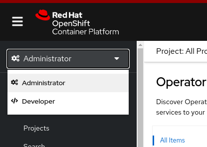
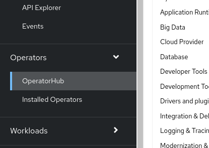
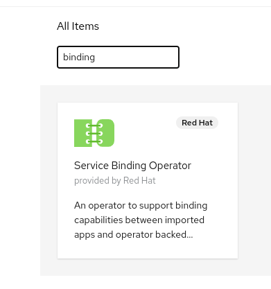
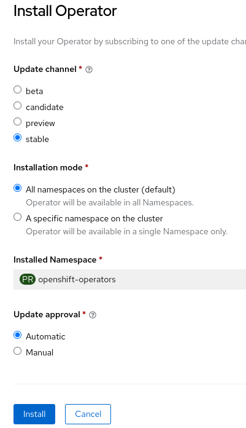
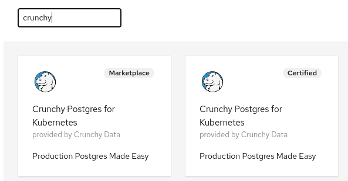
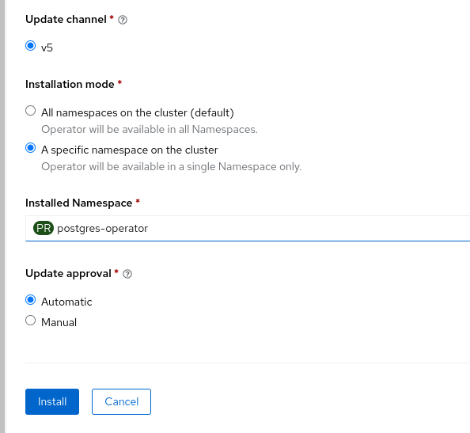
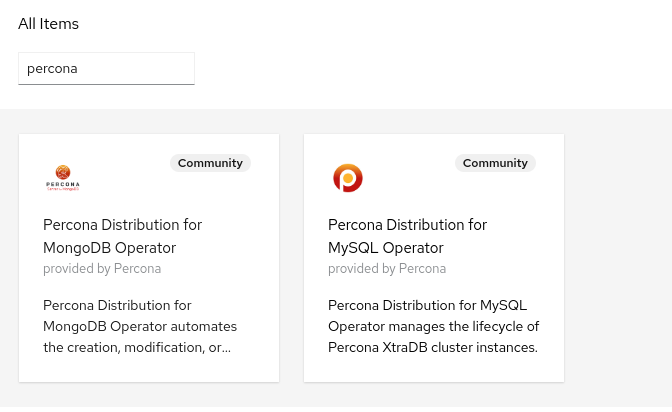
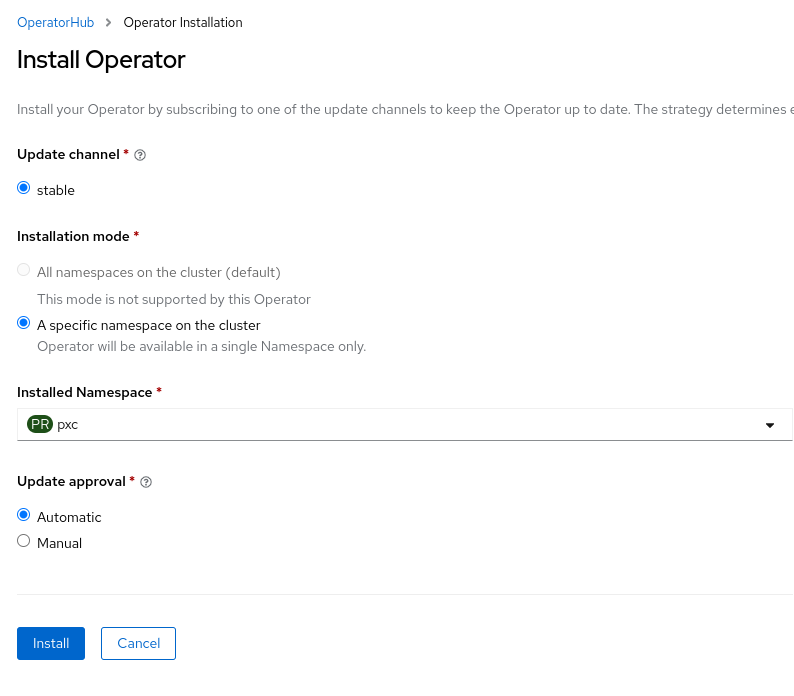
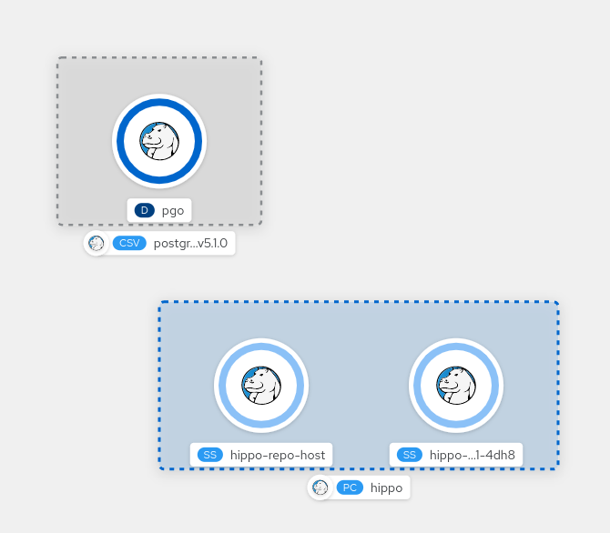
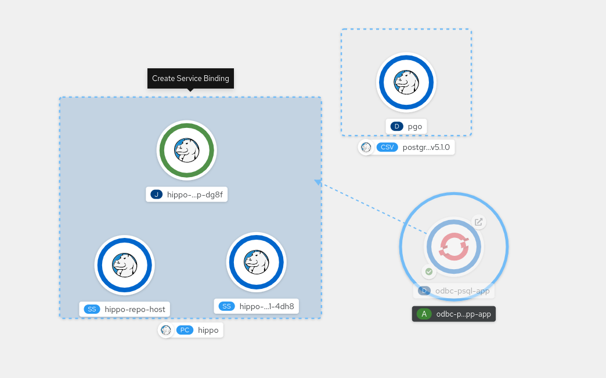

# kube-service-bindings

A repository with examples and links to examples utilizing [kube-service-bindings](https://www.npmjs.com/package/kube-service-bindings) npm package:

- KAFKA
  - [node-rdkafka](https://github.com/nodeshift-starters/reactive-example/tree/node-rdkafka)
  - [kafkajs](https://github.com/nodeshift-starters/reactive-example)
- POSTGRESQL
  - [pg](./src/pg/README.md)
  - [odbc](./src/odbc-psql/README.md)
- REDIS
  - redis
  - ioredis
- MONGODB
  - [mongoose](./src/mongoose/README.md)
  - [mongodb](./src/mongodb/README.md)
- AMQP
  - [rhea](./src/rhea/README.md)
- MYSQL
  - [mysql2](./src/mysql2/README.md)
  - [odbc](./src/odbc-mysql/README.md)
  - [mysql](./src/mysql/README.md)

# Basic instructions
The examples listed need some common configuration along with some additional components needed by the
example itself. In terms of common configuration they all need an OpenShift cluster and the service binding operator installed. As an example of additional components, the example showing how to use MYSQL with
kube-service-bindings needs a MYSQL database installed.

This section explains how to install those common and additional components. The README.md for each of the examples within this repo (not the external examples) which reference these instructions and tell you specifically what you need to install and in what order.
## Setup an OpenShift cluster on a Red Hat sandbox

Developer Sandbox hosted on the cloud provided for free by Red Hat, is a quick and easy way which requires zero setup with just a few clicks required only in creating a Red Hat account.

Steps for creating an OpenShift Cluster:

1. Visit https://developers.redhat.com/developer-sandbox/get-started
1. Click on Launch your Developer Sandbox for Red Hat OpenShift
1. Register for a Red Hat Account
1. After completing your registration, you get redirected to the initial page. Click on “Launch your Developer Sandbox for Red Hat Openshift”
1. Log in with your previously created Red Hat account
1. Fill the form with your personal information and click submit
1. Confirm your mobile phone number via text (don't forget to click on the Send Code button after filling you phone number)
1. Click on the “Start using your sandbox” button and your sandbox will start immediately!

More information about the Developer Sandbox on its resources and pre installed software are available [here](https://developers.redhat.com/developer-sandbox).

## Login to OpenShift

Visit OpenShift cluster and on upper right corner, click to expand your username. A dropdown will appear and by clicking on Copy login command you will be transferred to another page -> Display Token, copy the command looking similar to the below one and execute it on your terminal.

```
oc login --token=sha256~aaaaaaaa-aaaaaaaaaaaaaaaaaaaaaaaaaaaaaaaaaaa --server=https://your.oc.instance.url:6443
```

## Install Service binding operator

1. Select Administrator mode upper left

   

1. On operators click on operator hub

   

1. Search on the searchbox for binding and select the `Service Binding Operator`. Click on it and the click install

   

1. Select to install in on all namespaces

   

## Install Crunchy DB Operator

1. Create a namespace called postgres-operator

   ```
   oc create namespace postgres-operator
   ```

1. Select Administrator mode upper left

   

1. On operators click on operator hub

   

1. Search on the searchbox for crunchy and select the `Crunchy Postgres for Kubernetes` the Certified one. click on it and then click install

   

1. Select to install it on a specific namespace and on the dropdown select the namespace we previously created `postgres-operator`

   

## Install Percona Distribution for MySQL Operator

1. Select Administrator mode upper left

   

1. On operators click on operator hub

   

1. Search on the searchbox for "percona" and select the `Percona Distribution for MySQL Operator`. click on it and then click install

   

1. Select to install it on a specific namespace and on the dropdown select the namespace we previously created `pxc`

   

## Deploy MySQL - Percona XtraDB Cluster in Openshift

Hit below commands on your command line.

These commands are from [this](https://www.percona.com/doc/kubernetes-operator-for-pxc/kubernetes.html) tutorial and in case of something has changed, please visit the tutorial where the below commands are copied from.

```
git clone -b v1.10.0 https://github.com/percona/percona-xtradb-cluster-operator
cd percona-xtradb-cluster-operator
oc apply -f deploy/crd.yaml
oc create namespace pxc
oc config set-context $(kubectl config current-context) --namespace=pxc
oc apply -f deploy/rbac.yaml
oc apply -f deploy/operator.yaml
oc create -f deploy/secrets.yaml
oc apply -f deploy/cr.yaml
```

## Deploy PostgreSQL - Crunchy DB in Openshift

Below steps are from this [tutorial](https://access.crunchydata.com/documentation/postgres-operator/5.1.0/tutorial/), so in case of something has changed on below steps visit the above tutorial

1. clone repo with crunchy DB examples

```
git clone https://github.com/CrunchyData/postgres-operator-examples.git

```

2. Create a postgres cluster

```
cd postgres-operator-examples
oc apply -k kustomize/postgres
```

By visiting developer mode on topology, you should be able to see the postgres cluster being deployed



## Deploy Node.js application with Nodeshift

1. Install nodeshift (https://www.npmjs.com/package/nodeshift)

   ```
   npm install -g nodeshift
   ```

1. login with nodeshift

   ```
   nodeshift login --token=sha256~aaaaaaaa-aaaaaaaaaaaaaaaaaaaaaaaaaaaaaaaaaaa --server=https://your.oc.instance.url:6443
   ```

1. clone example app

   ```
   git clone https://github.com/nodeshift-blog-examples/kube-service-bindings-examples.git
   cd kube-service-bindings-examples/src/pg
   ```

1. nodeshift deploy
   ```
   nodeshift --namespace.name=<selected-project>
   ```

## Deploy Node.js app from OpenShift UI

1. Switch to developer mode
1. Select +Add from the sidebar menu
1. click on Import from Git
1. On Git Repo URL set `https://github.com/pacostas/kube-service-bindings-examples.git`
1. Click on show advanced Git options -> Context Dir set `/src/pg` -> Create

## Connecting Node.js app using service binding operator

Simply by dragging a line between the deployed app and the additional component used by the example (for example DB cluster) you should be able to share credentials between those two. The image below shows doing this with a database:


