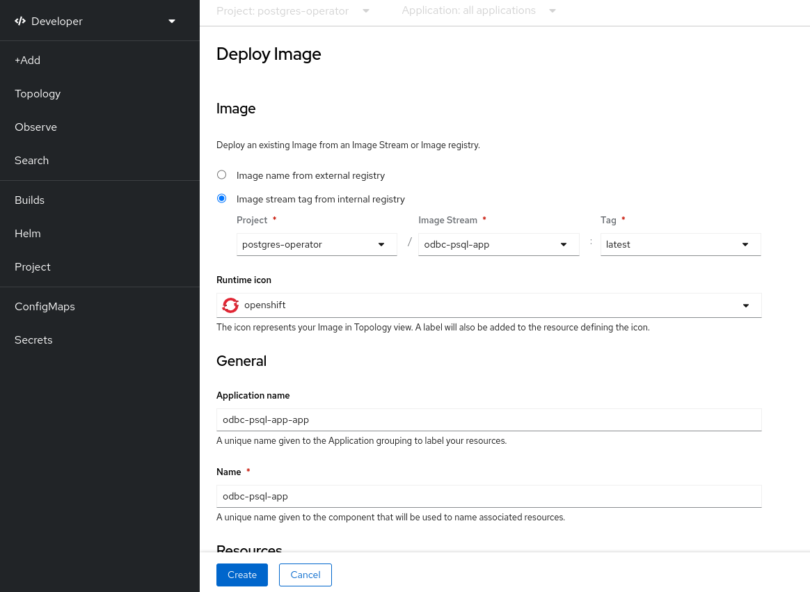

# POSTGRESQL - with odbc client

## Prerequisites

- [OpenShift Cluster](/README.md#setup-an-openshift-cluster-on-a-red-hat-sandbox)
- [Login to OpenShift](/README.md#login-to-openshift)

## Tutorial Reference

- https://access.crunchydata.com/documentation/postgres-operator/5.1.0/tutorial/

## Install Crunchy DB operator

- [Instructions](../../README.md#install-crunchy-db-operator)

## Install Service binding operator

- [Instructions](../../README.md#install-service-binding-operator)

## Deploy Crunchy DB

- [Instructions](../../README.md#deploy-postgresql---crunchy-db-in-openshift)

## Deploy odbc psql base image

1. clone example app

```
git clone https://github.com/nodeshift-blog-examples/kube-service-bindings-examples.git
cd kube-service-bindings-examples/src/odbc-psql
```

1. Create an imagestream

```
oc apply -f odbc-psql-base-imagestream.yaml
```

1. Create a build config

```
oc apply -f odbc-psql-base.yaml
```

## Deploy example application WITH Nodeshift

1. Install nodeshift (https://www.npmjs.com/package/nodeshift)

```
npm install -g nodeshift
```

1. login with nodeshift `nodeshift login --token=sha256~aaaaaaaa-aaaaaaaaaaaaaaaaaaaaaaaaaaaaaaaaaaa --server=https://your.oc.instance.url:6443`

1. Deploy app with nodeshift using as base image the previously created imagestream

```
nodeshift --imageStream=odbc-psql-base
```

## Deploy example application WITHOUT Nodeshift

1. Create image stream

   ```
   oc apply -f odbc-psql-base-imagestream.yaml
   ```

1. Create build config

   ```
   oc apply -f odbc-psql-app.yaml
   ```

1. Switch to developer mode
1. Select +Add from the sidebar menu
1. In case you havent select any namespace/project choose the `postgres-operator1
1. click on container image



1. Click on the radio button `Image stream tag from internal registry`
1. Select the `odbc-psql-app` image stream and set as tag the `latest`
1. Click on Create button

## Connecting Node.js using service binding operator

- [instructions](/README.md#connecting-nodejs-app-using-service-binding-operator)
